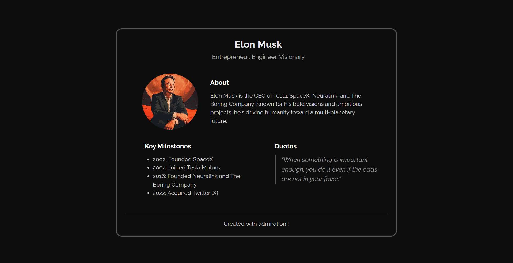

# Elon Musk Tribute Page

## Project Overview

### Description

A sleek and responsive tribute page honoring Elon Musk, highlighting his achievements and quotes with clean design and structured layout.

➡️ [Live Link](https://tribute-page-theta-two.vercel.app/)

### Screenshots

### Technologies Used

- **HTML** – Structured the content into semantic sections for the header, about section, milestones, and quotes.
- **CSS** – Styled the layout using flexbox and responsive design principles, added shadows, transitions, and typography enhancements.

### Learnings & Outcome

- Learned how to design clean, structured layouts that work seamlessly on various screen sizes.
- Gained experience in responsive flexbox layouts and elegant UI design with shadows and hover states.
- Improved CSS skills in styling images, typography, and visual hierarchy using custom fonts and Google Fonts integration.

### Connect with Me

Stay connected and explore more of my work:

Thanks for diving into this project! Let's create something amazing together. **Happy coding!** 🚀
